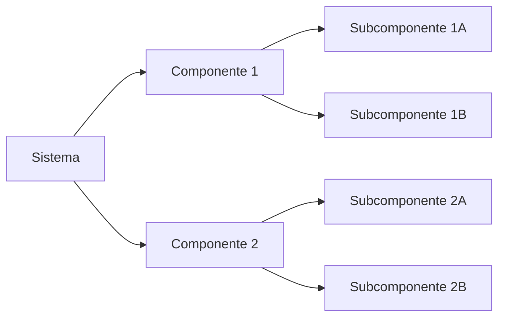

```mermaid
graph LR
    A[Sistema] --> B[Componente 1]
    A --> C[Componente 2]
    B --> D[Subcomponente 1A]
    B --> E[Subcomponente 1B]
    C --> F[Subcomponente 2A]
    C --> G[Subcomponente 2B]

```